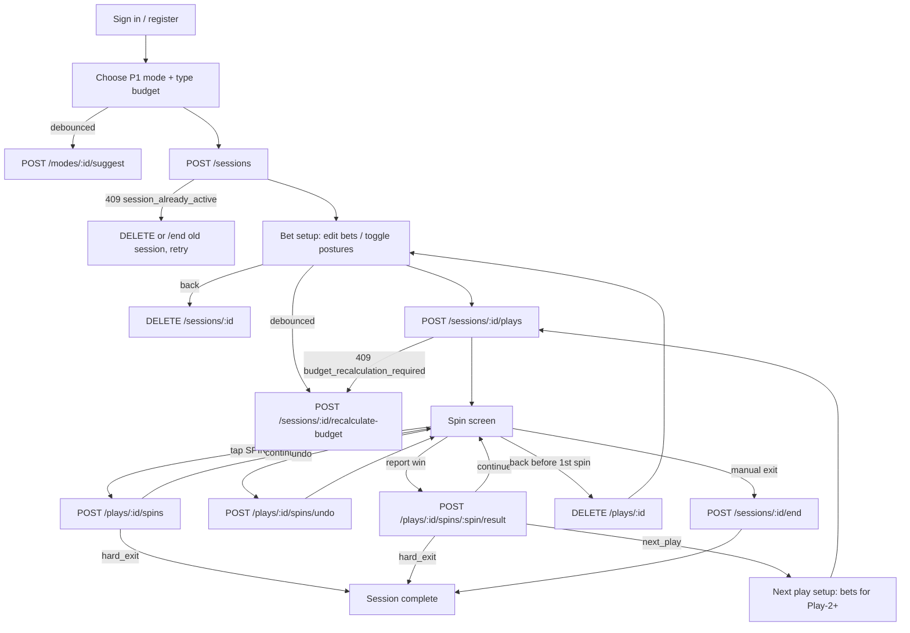

# CHA3535 API — Frontend Integration Guide

This guide is for developers building a CHA3535 client (the Flutter app, a web app, or any
other frontend). It explains how to sign users in, run a session from start to finish, and
handle every error the API can return.

The Flutter app in `cha_chingler/` is a complete, tested reference implementation:

| What | Where |
|---|---|
| HTTP client, token refresh, all endpoints | `cha_chingler/lib/services/api/cha3535_api.dart` |
| Response models | `cha_chingler/lib/services/api/api_models.dart` |
| Error type | `cha_chingler/lib/services/api/api_exception.dart` |
| Session / play / spin state machine | `cha_chingler/lib/models/session_model.dart` |
| Sign-in state | `cha_chingler/lib/models/auth_model.dart` |

Interactive docs (Swagger) are served at `{BASE_URL}/docs` and `{BASE_URL}/redoc` in every
environment except production.

---

## 1. Core rule: the server runs the engine

The client never knows the click map. It does not decide which posture (BASE / PRESS / MAX)
comes next, and it cannot compute the Session Budget. Every one of those values comes from
the API.

- Never cache or try to predict upcoming postures. The API never returns `click_number`,
  `zone_map` or any future-click data.
- Show only what the server returns: the posture and bet for the current spin, progress
  percentage, balances.
- The client may count clicks locally for display (e.g. "click 23 of 96"), using
  `click_cap` from the play response and incrementing on each successful spin.
- Never send `session_budget`, `current_balance` or other server-owned fields. Request
  bodies reject unknown fields with a 422.

---

## 2. Basics

### Base URL

```
{BASE_URL}/api/v1
```

`BASE_URL` is the deployed host (e.g. `https://api.example.com`). In the Flutter app it is
set at build time:

```
flutter run --dart-define=API_BASE_URL=https://api.example.com
```

The default (`http://10.0.2.2:8000`) points an Android emulator at a server on the dev
machine.

Health check (no prefix, no auth): `GET {BASE_URL}/healthz`.

### Requests and responses

- JSON in, JSON out: `Content-Type: application/json` (the avatar upload is the only
  multipart request).
- Authenticated endpoints need `Authorization: Bearer <access_token>`.
- IDs are UUID strings.
- Timestamps are ISO-8601 UTC strings.
- **Money**:
  - **In requests:** a number greater than 0, at most 1,000,000, with at most 2 decimal places (e.g. `12.5`).
  - **In responses:** money is always a JSON number (e.g. `890.0`). Format it for display on the client side.
- Successful `DELETE` calls return `204 No Content` with an empty body.

### CORS (web clients only)

Allowed methods are `GET`, `POST`, `PATCH`, and `DELETE`. The web app's origin must be added to
the server's `CORS_ORIGINS` setting; ask the backend team to add it for each environment.

---

## 3. Errors

### Error shape

Every business error has this shape:

```json
{
  "detail": {
    "code": "session_already_active",
    "message": "End your active session first",
    "session_id": "6c1d…"
  }
}
```

- `code` is stable and machine-readable. **Branch on `code`, never on `message`.**
- `message` is human-readable and safe to show to the user.
- Some errors add extra fields next to `code` (e.g. `session_id`, `min_budget`,
  `required_budget`). These are listed in the table below.

### Request validation errors

Request validation failures (wrong types, missing fields, unknown fields, bad bet order)
return **422** in FastAPI's standard format, where `detail` is a list:

```json
{
  "detail": [
    { "loc": ["body", "budget"], "msg": "Input should be greater than 0", "type": "greater_than" }
  ]
}
```

A robust client parses both shapes: if `detail` is an object, read `code`; if it is a list,
treat it as `validation_error` and join the `msg` values. See
`cha_chingler/lib/services/api/api_exception.dart`.

### Error code reference

| HTTP | `code` | When | Extra fields |
|---|---|---|---|
| 401 | `not_authenticated` | Missing, invalid or expired access token | — |
| 401 | `invalid_credentials` | Wrong email or password | — |
| 401 | `invalid_refresh_token` | Refresh token bad or expired | — |
| 401 | `refresh_token_reused` | An old refresh token was reused; **all** the user's sessions are signed out | — |
| 401 | `missing_refresh_token` | `/auth/refresh` called with no token in body or cookie | — |
| 403 | `account_suspended` | Account is suspended | — |
| 404 | `session_not_found`, `play_not_found`, `spin_not_found`, `mode_not_found` | Unknown ID, or it belongs to another user | — |
| 409 | `email_taken` / `username_taken` / `account_conflict` | Registration or rename conflict | — |
| 409 | `session_already_active` | User already has an active session | `session_id` |
| 409 | `session_not_active` | Session already ended | — |
| 409 | `session_has_plays` | Tried to discard a session that has plays (end it instead) | — |
| 409 | `play_already_active` | Tried to start a play while one is running | — |
| 409 | `play_not_active` | Play already ended | `status` |
| 409 | `play_has_spins` | Tried to discard a play that has spins | — |
| 409 | `budget_recalculation_required` | Play-1 bets need a bigger budget; recalculate first | `required_budget` |
| 409 | `concurrent_spin` | Two spins registered at the same moment; retry once | — |
| 409 | `nothing_to_undo` | No spin to undo | — |
| 409 | `result_already_submitted` | Spin already has a result (can't resubmit or undo it) | — |
| 409 | `stale_spin` | Result sent for a spin that isn't the latest | — |
| 409 | `no_billing_account` | Billing portal requested before any subscription | — |
| 413 | `avatar_too_large` | Avatar over 5 MB | — |
| 415 | `unsupported_image` | Avatar isn't JPEG / PNG / WebP | — |
| 422 | `budget_below_minimum` | Budget below the mode's minimum | `min_budget` |
| 422 | `mode_unavailable` | Mode switched off by an admin | — |
| 422 | `invalid_result` | Bad result text, multiplier outside 1–10000, etc. | — |
| 422 | (list) | Request validation failure (see above) | — |
| 429 | `rate_limited` | Too many requests; wait `Retry-After` seconds | `Retry-After` header |
| 503 | `maintenance_mode` | New sessions temporarily disabled | — |
| 503 | `billing_unavailable` | Stripe not configured on this server | — |
| 503 | `player_number_exhausted` | Server couldn't allocate a player number (retry) | — |

### Rate limits

| Endpoint | Limit |
|---|---|
| `POST /auth/register` | 10 per hour per IP |
| `POST /auth/login` | 5 per 15 minutes per IP |
| `POST /plays/{id}/spins` | 120 per minute per user |
| `POST /plays/{id}/spins/undo` | 60 per minute per user |

---

## 4. Authentication

### Tokens

| Token | Lifetime | Use |
|---|---|---|
| `access_token` (JWT) | 15 minutes (`expires_in` seconds) | `Authorization: Bearer …` on every authenticated call |
| `refresh_token` | 30 days | Exchange for a new pair at `/auth/refresh` |

- **Refresh tokens rotate.** Every refresh returns a new pair, and the old refresh token stops
  working. If an old token is used again, the server returns `refresh_token_reused` and signs
  out every device of that user.
- **Mobile:** store both tokens in secure storage (the Flutter app uses
  `flutter_secure_storage`) and send the refresh token in the request body.
- **Web:** login, register and refresh also set an `httpOnly` cookie
  `cha_refresh_token` (path `/api/v1/auth`). A browser client can call `/auth/refresh`
  with `credentials: "include"` and an empty body, and keep the access token only in
  memory.

### Recommended refresh logic

1. Send the request with the current access token.
2. On **401** (from any endpoint except `/auth/login`, `/auth/register`, `/auth/refresh`),
   call `/auth/refresh` **once**. If several requests fail together, share a single
   in-flight refresh (single-flight) so the rotation isn't triggered twice.
3. If the refresh succeeds, save the new pair and retry the original request once.
4. If the refresh fails with a 401, clear the tokens and send the user to the sign-in screen.

On app start: if a refresh token is stored, call `GET /auth/me`. The refresh logic above
handles an expired access token. If `/auth/me` succeeds, the user is signed in.

### Endpoints

#### `POST /auth/register` → 201

```json
{ "email": "ana@example.com", "password": "s3cretpass", "username": "Ana_77" }
```

- `password`: 8–72 characters.
- `username`: optional, 2–32 characters, letters/digits/space/`_`/`.`/`-`.

#### `POST /auth/login` → 200

```json
{ "email": "ana@example.com", "password": "s3cretpass" }
```

**Both return `AuthResponse`:**

```json
{
  "access_token": "eyJ…",
  "refresh_token": "eyJ…",
  "token_type": "bearer",
  "expires_in": 900,
  "user": {
    "id": "3f0c…",
    "player_number": 1042,
    "username": "Ana_77",
    "email": "ana@example.com",
    "avatar_url": null,
    "tier": "vip",
    "subscription_status": "trialing",
    "created_at": "2026-10-01T12:00:00Z",
    "last_login_at": "2026-10-05T09:30:00Z"
  }
}
```

The `UserProfile` fields:

- `tier`: one of `vip`, `black`, `elite`, `diamond`. Use it for theming and plan badges.
- `subscription_status`: for example `active`, `trialing`, `past_due` or `canceled`.

#### `POST /auth/refresh` → 200

```json
{ "refresh_token": "eyJ…" }
```

The body can be omitted when the cookie is used. Returns `TokenResponse`, which is
`AuthResponse` without `user`.

#### `POST /auth/logout` → 200 (auth required)

```json
{ "refresh_token": "eyJ…" }
```

Returns `{ "status": "logged_out" }`. Clear the local tokens even if this call fails.

#### `GET /auth/me` → `UserProfile`

---

## 5. Profile

#### `PATCH /users/me` → `UserProfile`

```json
{ "username": "Ana Bets" }
```

Can return `409 username_taken`.

#### `POST /users/me/avatar` → `{ "avatar_url": "…" }`

Multipart form with one field, `file`: JPEG, PNG or WebP, up to 5 MB.

The returned URL is either a server path (`/media/...`; prefix it with `BASE_URL`) or a
pre-signed S3 URL that expires after about 1 hour. Call `GET /auth/me` again to get a fresh
URL instead of caching it for long.

---

## 6. Plans and billing (Stripe)

#### `GET /billing/plans` (public)

```json
[
  {
    "tier": "vip", "name": "VIP", "tier_label": "TIER 1", "badge": "ENTRY",
    "price_cents": 999, "interval": "month", "trial_days": 7,
    "features": ["Play-1 full command map", "…"]
  }
]
```

Tiers in order: `vip` ($9.99), `black` ($24.99), `elite` ($49.99), `diamond` ($99.99).

#### `POST /billing/checkout` → `{ "checkout_url": "https://checkout.stripe.com/…" }`

```json
{ "tier": "black" }
```

#### `POST /billing/portal` → `{ "portal_url": "https://billing.stripe.com/…" }`

Lets the user manage or cancel their subscription. Returns `409 no_billing_account` if the
user has never subscribed.

**Flow:**

1. Open the Stripe URL in the system browser (or redirect, on web).
2. Stripe tells the server about the change through a webhook, so the client does nothing else.
3. When the user returns to the app (app resumed or page focus), call `GET /auth/me` to pick
   up the new `tier` and `subscription_status`.

`503 billing_unavailable` means billing isn't configured on that server. Hide or disable
the upgrade buttons.

---

## 7. Game concepts

| Term | Meaning |
|---|---|
| **P1 mode** | Strategy chosen for Play-1. Values: `entertainment`, `entertainment_plus`, `strike`, `pursuit`, `deep_run_pro`. |
| **Session** | One sitting at a machine, with a server-managed **Session Budget** and **current balance**. Only one active session per user. |
| **Play** | A run of spins inside a session. Plays are numbered 1–6; after Play-6 the next play is Play-1 of the next **cycle** (`cycle_number` + 1). Only one active play at a time. |
| **Spin** | One press of the machine's spin button. The server picks its **posture** and bet. |
| **Posture** | `base`, `press` or `max`, mapped to the confirmed bet amounts. `early_attack` may appear; display it as PRESS. |
| **Click cap** | Maximum spins in a play: the mode's `click_cap` for the very first play (96 by default), **70** for every later play. |
| **Qualifying result** | A win of **10× the bet or more**, or a **bonus**. It ends the current play successfully, and the player moves to the next play. |
| **Hard exit** | The cap is reached without a qualifying result. The server ends the play **and the session** and grades it. |
| **Manual exit** | The player ends the session themselves. |

### Mode catalogue

The current seed data is shown below. Always read the live values from `GET /modes`, because admins can change them.

| `mode_id` | Label | Min budget | Baseline bets (base / press / max) |
|---|---|---|---|
| `entertainment` | Entertainment Mode | none | none (bets derived from budget) |
| `entertainment_plus` | Entertainment Mode+ | $1,300 | 5 / 10 / 25 |
| `strike` | Strike Mode | $555 | 5 / 10 / 30 |
| `pursuit` | Pursuit Mode | $625 | 5 / 10 / 30 |
| `deep_run_pro` | Deep Run Pro | $775 | 5 / 10 / 30 |

### Posture rules

- The player may switch postures off, but **at least 2 must stay active**. Send the active
  ones as `active_postures`, e.g. `["base", "max"]`. Omitting the field means all three are
  active.
- Amounts of active postures must be in order: **base ≤ press ≤ max** (a 422 otherwise). The
  amount sent for a switched-off posture is ignored, but it must still be a valid number
  greater than 0. Sending the nearest active amount is simplest.
- When the map lands on a switched-off posture, the server plays the **nearest active
  posture below** it, or the nearest above if there is none below. For example, with PRESS
  off, a PRESS click is played at BASE.

### Session Budget rules

- **Before Play-1 starts**, the budget follows the bets both up and down:
  - The suggested ladder with all postures active keeps the player's typed budget and the
    mode minimum as floors.
  - Hand-entered bets, or any switched-off posture, cost exactly their full-map exposure.
- **After Play-1 starts**, the budget can only rise.
- When the budget changes, `current_balance` moves by the same amount.
- Each spin subtracts its bet from `current_balance`. Each result adds its `win_amount`.
  Undo reverses the spin.

---

## 8. Modes and pricing endpoints

#### `GET /modes` (public)

```json
[
  {
    "mode_id": "strike", "label": "Strike Mode", "min_budget": 555.0, "click_cap": 96,
    "baseline_base": 5.0, "baseline_press": 10.0, "baseline_max": 30.0
  }
]
```

Only active modes are listed. `min_budget` and the baselines can be `null`.

#### `POST /modes/{mode_id}/suggest` (auth)

Suggested bets for a budget the player is typing. Use it before the session exists, with a
debounce of about 300 ms.

```json
{ "budget": 555 }
```
```json
{ "mode_id": "strike", "suggested_base": 5.0, "suggested_press": 10.0, "suggested_max": 30.0, "session_budget": 890.0 }
```

`session_budget` is what the session will actually open with. It can be higher than the
typed budget, because the suggested bets must cover the full map.

#### `POST /modes/{mode_id}/exposure` (auth)

Prices any ladder without a session.

```json
{ "base": 5, "press": 10, "max": 30, "active_postures": ["base", "press", "max"] }
```
```json
{ "mode_id": "strike", "exposure": 890.0, "required_budget": 890.0 }
```

---

## 9. Session endpoints

#### `POST /sessions` → 201

```json
{ "p1_mode": "strike", "budget": 555 }
```
```json
{
  "session_id": "6c1d…",
  "p1_mode": "strike",
  "session_budget": 890.0,
  "current_balance": 890.0,
  "suggested_base": 5.0,
  "suggested_press": 10.0,
  "suggested_max": 30.0,
  "mode_click_cap": 96,
  "play_number": 1,
  "cycle_number": 1
}
```

Errors:

- `409 session_already_active` (with `session_id`): see section 11.
- `422 budget_below_minimum` (with `min_budget`).
- `422 mode_unavailable`.
- `503 maintenance_mode`.

#### `POST /sessions/{id}/recalculate-budget`

Call this whenever the player edits bets or toggles postures before Play-1, with a debounce
of about 300 ms. Show the returned budget and balance.

```json
{ "base": 5, "press": 12, "max": 30, "active_postures": ["base", "press", "max"] }
```
```json
{ "required_budget": 932.0, "adjusted": true, "new_budget": 932.0, "current_balance": 932.0 }
```

#### `GET /sessions/{id}` → `SessionOut`

```json
{
  "id": "6c1d…", "p1_mode": "strike", "status": "active",
  "session_budget": 890.0, "current_balance": 845.0, "total_wagered": 105.0,
  "confirmed_base": 5.0, "confirmed_press": 10.0, "confirmed_max": 30.0,
  "play_count": 1, "play_number": 1, "cycle_number": 1,
  "execution_grade": null,
  "started_at": "2026-10-05T09:31:00Z", "ended_at": null
}
```

`status` is one of `active`, `completed`, `hard_exit` or `manual_exit`.

#### `POST /sessions/{id}/end` → `SessionOut`

This is a manual exit. The response has `status: "manual_exit"`, `ended_at`, the final balances,
and `execution_grade`. Show these on the session-complete screen.

#### `DELETE /sessions/{id}` → 204

Discards a session that has **no plays** and leaves no history. Use it when the player backs
out of bet setup. A session with plays returns `409 session_has_plays`; end it instead.

#### `GET /sessions?page=1&page_size=20&status=completed` → history

```json
{ "items": [ /* SessionOut */ ], "total": 42, "page": 1, "page_size": 20 }
```

- `page_size` is at most 100.
- `status` is optional and filters by session status.
- Results are newest first.

---

## 10. Play and spin endpoints

#### `POST /sessions/{id}/plays` → 201 (start a play)

```json
{ "confirmed_base": 5, "confirmed_press": 10, "confirmed_max": 30, "active_postures": ["base", "press", "max"] }
```
```json
{
  "play_id": "a91e…",
  "status": "active",
  "posture": "base",
  "next_bet_amount": 5.0,
  "play_progress_pct": 0,
  "play_number": 1,
  "cycle_number": 1,
  "click_cap": 96,
  "current_balance": 890.0,
  "session_budget": 890.0
}
```

`posture` and `next_bet_amount` are the bet for the **first** spin.

Errors:

- `409 play_already_active`.
- `409 session_not_active`.
- `409 budget_recalculation_required` (with `required_budget`), **Play-1 only**: call
  `recalculate-budget` with the same ladder, then retry the start.

#### `POST /plays/{play_id}/spins` (no body)

Register a spin. Call it when the player taps SPIN.

```json
{
  "spin_id": "0b7f…",
  "posture": "press",
  "next_bet_amount": 10.0,
  "play_progress_pct": 24,
  "play_number": 1,
  "cycle_number": 1,
  "at_hard_exit_cap": false,
  "current_balance": 845.0,
  "redirect": "continue"
}
```

- `posture` and `next_bet_amount` are the posture and bet **of the spin just registered**.
  Show them as "bet $10 (PRESS) now". The amount has already been deducted from
  `current_balance`.
- Keep `spin_id`; you need it to submit a win.
- `at_hard_exit_cap: true` means this was the last allowed spin. The player can still report
  a win for it. If they spin again, or report a non-qualifying result, the session hard-exits.
- `redirect: "hard_exit"` (with `spin_id: null`) means the cap was already reached. The play
  **and the session** are closed, so go to the session-complete screen.
- `409 concurrent_spin`: retry once.

#### `POST /plays/{play_id}/spins/undo` (no body)

Reverses the latest spin, for example after an accidental tap. A spin that already has a
result can't be undone.

```json
{
  "posture": "base", "bet_amount": 5.0, "has_spins": true,
  "play_progress_pct": 23, "play_number": 1, "cycle_number": 1, "current_balance": 855.0
}
```

When `has_spins` is false, the play is back to zero spins, and `posture` / `bet_amount` are the
first-spin bet again.

Errors: `409 nothing_to_undo`, `409 result_already_submitted`.

#### `POST /plays/{play_id}/spins/{spin_id}/result`

Report what the machine paid on the **latest** spin. Send one of these bodies:

| Situation | Body |
|---|---|
| Player typed the dollar payout | `{ "win_amount": 340 }` (converted to a multiplier: win ÷ bet) |
| Player typed a multiplier | `{ "result": "34x" }` (also accepts `"34"`; range 1–10000) |
| Bonus round | `{ "result": "bonus", "win_amount": 1200 }` (`win_amount` optional) |

Sending a multiplier together with `win_amount` is rejected (422).

```json
{
  "qualifying": true,
  "win_amount": 340.0,
  "multiplier": 34.0,
  "current_balance": 1185.0,
  "redirect": "next_play",
  "play_number": 1,
  "cycle_number": 1
}
```

What to do for each `redirect`:

| `redirect` | Meaning | Client action |
|---|---|---|
| `continue` | Win recorded, but below 10× and the cap isn't reached. The play goes on. | Stay on the spin screen. |
| `next_play` | Qualifying win (10× or more, or a bonus). This play is completed. | Show the win and go to "next play" setup. |
| `hard_exit` | Non-qualifying result on the cap spin. The session is closed. | Go to the session-complete screen. |

Errors:

- `409 stale_spin` (not the latest spin).
- `409 result_already_submitted` (one result per spin).
- `422 invalid_result`.

#### `GET /plays/{play_id}` → `PlayState`

```json
{
  "play_id": "a91e…", "status": "active", "posture": "press", "next_bet_amount": 10.0,
  "play_progress_pct": 24, "play_number": 1, "cycle_number": 1,
  "result_type": null, "win_amount": 0.0, "current_balance": 845.0
}
```

- `status` is one of `active`, `completed`, `hard_exit` or `manual_exit`.
- `result_type` is one of `multiplier`, `bonus`, `hard_exit`, `manual_exit` or `null`.

#### `POST /plays/{play_id}/end` → `PlayState`

Ends only the current play (manual exit of the play). The session stays active, and the next
play can be started.

#### `DELETE /plays/{play_id}` → 204

Discards a play that has **no spins**, for example when the player backs out of the spin
screen before the first spin. A play with spins returns `409 play_has_spins`.

---

## 11. End-to-end flow



### Step by step

1. **Sign in.** Call `POST /auth/login` or `/auth/register`, then save the tokens.
2. **Pick the mode and budget.**
   - Load `GET /modes`.
   - As the player types a budget, call `POST /modes/{id}/suggest` (debounced) to show the
     suggested ladder and the real opening budget.
   - Block budgets below `min_budget`.
3. **Create the session** with `POST /sessions`.
   - On `409 session_already_active`, take `session_id` from the error and close that
     session: try `DELETE /sessions/{id}`, and if that returns `409 session_has_plays`, call
     `POST /sessions/{id}/end`. Then retry the create.
   - Pre-fill the bet fields from `suggested_*`.
4. **Bet setup (before Play-1).**
   - Every time bets or posture toggles change, call `recalculate-budget` (debounced) and
     show `new_budget` / `current_balance`.
   - Before starting the play, wait for any pending recalculation to finish.
   - If the player backs out, `DELETE /sessions/{id}`.
5. **Start Play-1** with `POST /sessions/{id}/plays`.
   - On `budget_recalculation_required`, call `recalculate-budget` with the same ladder,
     then retry once.
   - Show the first bet from `posture` / `next_bet_amount`.
6. **Spin loop.**
   - **SPIN tap:** call `POST /plays/{id}/spins`. Show `posture` / `next_bet_amount` as the
     bet to place now. Update the balance, the progress bar (`play_progress_pct`), and the
     local click count. Remember `spin_id`.
   - **Undo:** call `POST …/spins/undo`.
   - **Win:** call `POST …/spins/{spin_id}/result`, then follow `redirect`.
   - **Cap reached:** if `at_hard_exit_cap` is true, warn the player that this is the last
     spin.
7. **Next play.**
   - After `next_play`, show the next play number (`play_number` + 1, wrapping 6 → 1 with
     `cycle_number` + 1).
   - Let the player confirm the bets, then call `POST /sessions/{id}/plays` again.
   - Plays 2 and later have a cap of 70 spins and no budget recalculation step.
8. **End.**
   - **Manual exit:** `POST /sessions/{id}/end`. A `session_not_active` error means it's
     already closed; treat that as success.
   - **Hard exit:** the server already closed the session. Optionally call
     `GET /sessions/{id}` for the final numbers and grade.
   - Show the session-complete screen using `SessionOut`.
9. **History.** Call `GET /sessions?page=…`.

### Resuming after an app restart

The API has no "current play" lookup. If the app is killed mid-session, the next
`POST /sessions` returns `session_already_active`. Close the old session as in step 3 and
start fresh. Do the same when a user signs in on a new device.

---

## 12. UI and implementation tips

- **Disable buttons while a request is in flight.** This applies especially to SPIN, so one
  tap is one spin. Show the server's `message` when a call fails.
- **Debounce pricing calls** (suggest and recalculate) by about 300 ms. Ignore responses
  that arrive after a newer request was sent, using a sequence counter.
- **Trust server numbers.** After every call, replace the local balance, budget and progress
  with the values in the response.
- **Postures in the UI:** show BASE / PRESS / MAX. Map `early_attack` to PRESS.
- **Spin gauge:** colour only the clicks already played, using the postures the server
  returned for each spin. Show future clicks as neutral or unknown.
- **Network errors:** the Flutter client retries nothing automatically except the single
  token refresh. Let the user tap again. Spins are safe to retry, because a failed request
  registers nothing, and a duplicate tap can be reverted with undo.
- **Plan theming:** use `user.tier` from `/auth/me`. Refresh it when the app resumes after
  checkout.

---

## 13. Quick test with curl

```bash
BASE=https://api.example.com/api/v1

TOKEN=$(curl -s -X POST $BASE/auth/login -H 'Content-Type: application/json' \
  -d '{"email":"ana@example.com","password":"s3cretpass"}' | jq -r .access_token)

SID=$(curl -s -X POST $BASE/sessions -H "Authorization: Bearer $TOKEN" \
  -H 'Content-Type: application/json' -d '{"p1_mode":"strike","budget":555}' | jq -r .session_id)

PID=$(curl -s -X POST $BASE/sessions/$SID/plays -H "Authorization: Bearer $TOKEN" \
  -H 'Content-Type: application/json' \
  -d '{"confirmed_base":5,"confirmed_press":10,"confirmed_max":30}' | jq -r .play_id)

SPIN=$(curl -s -X POST $BASE/plays/$PID/spins -H "Authorization: Bearer $TOKEN")
echo $SPIN

curl -s -X POST $BASE/plays/$PID/spins/$(echo $SPIN | jq -r .spin_id)/result \
  -H "Authorization: Bearer $TOKEN" -H 'Content-Type: application/json' -d '{"win_amount":300}'

curl -s -X POST $BASE/sessions/$SID/end -H "Authorization: Bearer $TOKEN"
```
